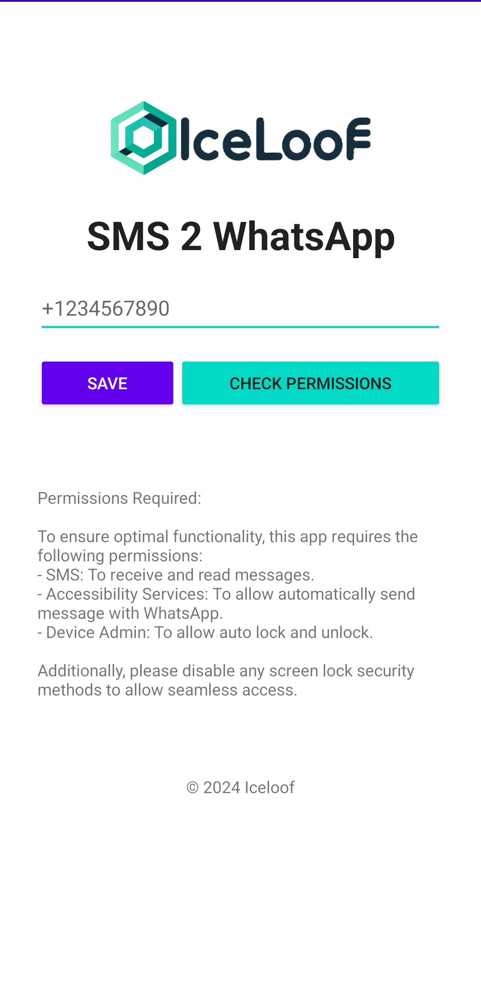
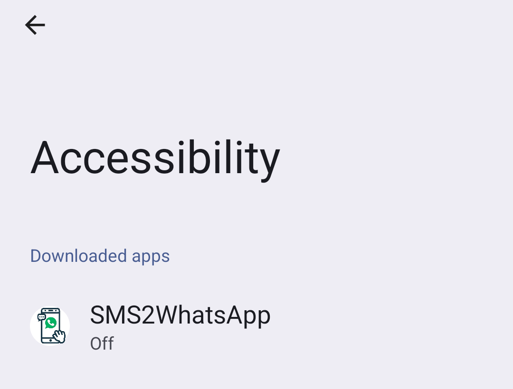
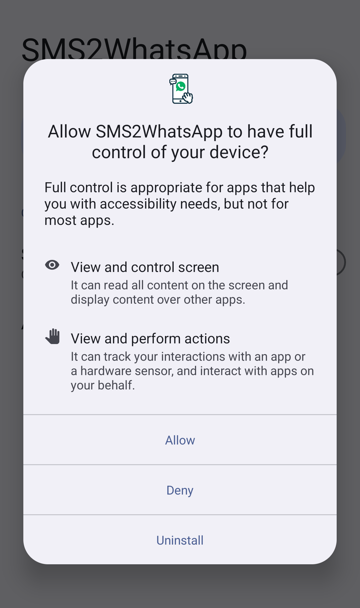
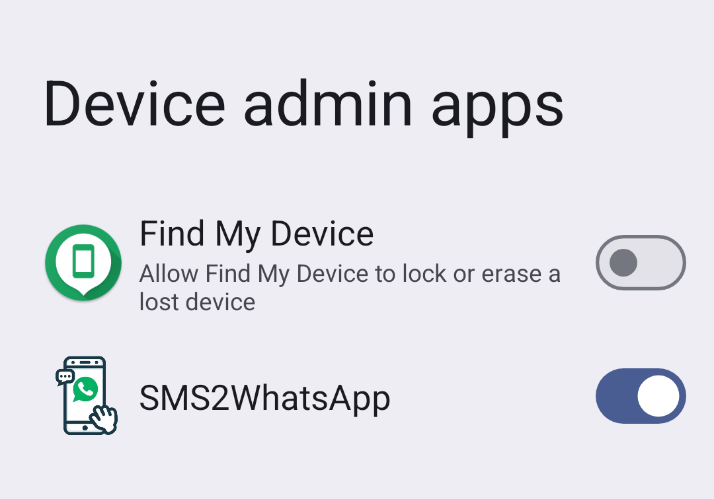
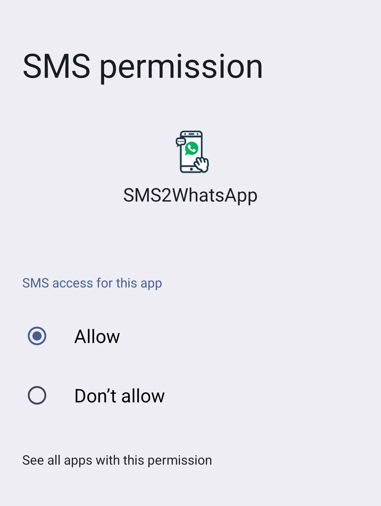

# SMS2WhatsApp

## Notes

This project was generated by Copilot for personal use only. The author is not responsible for any risks or issues that may arise from using this application.

## Purpose

**SMS2WhatsApp** is an Android application designed to personally use on backup phone to monitor incoming SMS messages and automatically forward them to a specified WhatsApp contact. This app is ideal for users who want to ensure they never miss important messages by having them forwarded to their preferred messaging platform.

## Features

- **Automatic SMS Monitoring**: Continuously monitors incoming SMS messages.
- **WhatsApp Forwarding**: Automatically forwards the content of SMS messages to a specified WhatsApp contact.
- **User-Friendly Interface**: Simple and intuitive interface for easy setup and use.

## Screenshots












## Permissions Required

To ensure optimal functionality, this app requires the following permissions:
- **SMS**: To receive and read messages.
- **Accessibility Services**: To enhance user experience and provide additional features.
- **Device Admin**: For advanced security and management capabilities.

Additionally, please disable any screen lock security methods to allow seamless access.

## Installation

1. Clone the repository:
    ```bash
    git clone https://github.com/Iceloof/SMS2WhatsApp.git
    ```
2. Open the project in Android Studio.
3. Build and run the app on your Android device.

## Usage

1. Open the app and grant the necessary permissions.
2. Configure the WhatsApp contact to which SMS messages should be forwarded.
3. Enable the SMS monitoring service.

## Contributing

Contributions are welcome! Please fork the repository and submit a pull request with your changes.

## License

This project is licensed under the MIT License - see the LICENSE file for details.

